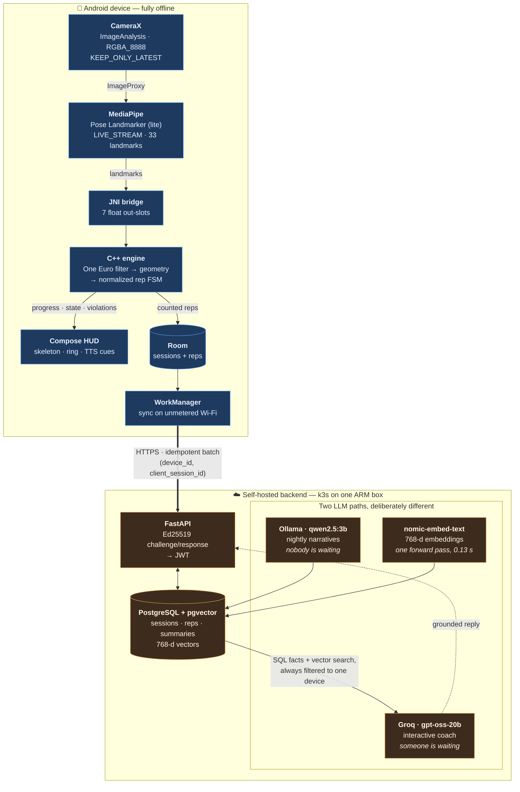

# KineX

An Android app that watches you exercise through the phone camera, counts your reps on-device
in C++, and tells you when your form slips. It syncs to a self-hosted backend that generates
nightly training summaries on a local LLM and answers questions about your own training
history through a retrieval-grounded coach.

Everything on the device runs offline — no network is required to work out. Nothing leaves the
phone until you have an account, and an account is a keypair, not an email address.

> Portfolio repository; no published binaries. Built and installed via Android Studio.

<!-- Drop a HUD screenshot here: rep count, progress ring, skeleton overlay, violation chip. -->


---

## How it fits together



The split that shapes the whole backend: **generation is autoregressive** — one forward pass
per output token, ~2.9 tok/s on two ARM cores — so it can only live in a job nobody is waiting
on. **An embedding is a single forward pass**, 0.13 s warm, so it can sit inside a request a
person is waiting on. Same container, opposite latency budgets.

---

## Stack

| Layer | What |
| --- | --- |
| **UI** | Kotlin, Jetpack Compose, Material 3, MVVM, type-safe `@Serializable` nav routes. Dark theme only |
| **Vision** | CameraX `ImageAnalysis` → MediaPipe Pose Landmarker (`pose_landmarker_lite.task`), live stream |
| **Engine** | C++ via NDK + CMake. One Euro filter → joint geometry → a rep FSM on *normalized progress*, so one state machine serves all ten exercises |
| **Storage** | Room (WAL), schemas exported and committed. WorkManager for sync |
| **Auth** | Anonymous Ed25519 keypair from a 12-word BIP-39 phrase. No email, no password, no PII server-side |
| **API** | Python 3.12, FastAPI, asyncpg (no ORM), Alembic, `pydantic-settings` |
| **Data** | PostgreSQL 17 + pgvector — relational rows *and* embeddings in one database |
| **LLM** | Ollama (`qwen2.5:3b`, `nomic-embed-text`) for batch; Groq (`openai/gpt-oss-20b`) for chat, behind one provider interface |
| **Infra** | k3s single-node on an Oracle Always Free ARM box (2 OCPU / 12 GB), Traefik, cert-manager, GHCR |
| **CI** | GitHub Actions — backend suite + arm64 image, and the C++ engine suite under ASan/UBSan/LSan |

---

## What is verified, and what is not

This is the part most fitness-tracking demos leave vague, so it is stated plainly.

**Rep counting generalizes. Form checking does not.**

The FSM works on normalized progress — `0.0` at the calibrated start pose, `1.0` at the target
angle — so every exercise reuses one state machine and adding an exercise is a table row, not
code. That part holds across all ten.

Form violations are different. Each one needs its own fixture, its own thresholds and its own
tuning against real movement.

| | Status |
| --- | --- |
| **Squat** | The **only** validated exercise. Side view, violation rules tuned against recorded fixtures and verified on device |
| **The other nine** | Rep counting works. **`violation_rules = 0`** — a clean-form indicator on these means *nothing was ever checked*, not that the form was good. Thresholds are literature-derived plus one device sweep |

A ten-exercise sweep on a Pixel 6a (20 Aug 2026) was the first time nine of those rows had ever
been run by a person, and it found three real defects. Each was **fixed at the cause rather than
tuned around**:

| Found | Cause | Fix |
| --- | --- | --- |
| Shoulder press read a peak progress of **38.75** where 1.0 is the target | A calibration captured near the target collapsed the span, and nothing rejected it | A **calibration span guard** — a capture is refused unless it spans at least half the configured range |
| Push-up counted **21 reps for roughly four** performed | The alignment gate was held open (`kAligned = true`), so nothing checked the athlete was in frame and side-on before counting | The **gate is closed**; `kAligned = true` is gone from `engine.cpp` |
| Tricep extension **never calibrated** | Its joint triple could not produce a usable span from a front view | The row was **replaced by the jumping jack** at id 8 |

**These fixes are covered by the native suite but have not been re-verified on a phone.** The
span guard and the plausibility bound were both mutation-proved — each constant set to `0`,
three tests watched going red, then reverted and re-run green — and `squat_8rep` counts 8 of 8
through the replay with the gate closed. That is the strongest statement available: the causes
are addressed and the tests fail when the guards are removed, but nine of the ten rows have not
been through a device sweep since, and the jumping jack has never been run by a person at all.

The 38.75 is still in the repository rather than smoothed away, because storing that value
unclamped is what made the bug findable in the first place. See the app design doc
for the full sweep table and both sets of numbers.

**Also not established:** no set counted from live landmarks has yet synced end to end — the
camera-to-row half and the row-to-backend half are each verified and the join between them is
not. The airplane-mode sync path has never been observed. Nothing is deployed to Oracle; the
k3s manifests are verified against a laptop k3d cluster only.

---

## Numbers

| | |
| --- | --- |
| **C++ engine suite** | **55 tests** — 22 exercise config, 19 rep FSM, 8 geometry, 6 One Euro. Plus a JNI leak soak and ASan/UBSan, each judged by exit code |
| **Backend suite** | **85 tests** in ~8 s, against a real PostgreSQL — never a mock |
| **Android suite** | **37 tests** — unit, Room migration against a v1 database of 200 sessions, and instrumented against the live backend |
| **Coach chat latency** | **0.5–1.7 s** end to end — local embedding → pgvector + SQL → Groq → reply |
| **Batch summary generation** | 219 s for a real device, CPU-only, cold model load included. Runs at 03:00 |
| **Frame rate** | **10–20 FPS** observed on a Pixel 6a during the ten-exercise sweep, against a 30 FPS target. Not yet closed |
| **Embedding** | 4.1 s cold model load, then **0.13 s** warm, L2-normalised at 768 dimensions |

**177 tests in total.** Eight backend properties and five client ones were **mutation-tested** —
each guarantee deliberately broken, the specific test watched going red, and the source restored
and verified byte-identical in the same session. One of those runs found a test that stayed
green when it should not have, and it was strengthened and re-mutated. A test that has never
been seen failing is not evidence.

---

## Running it

### The backend, locally

```bash
cd backend
cp .env.example .env          # add a Groq key: https://console.groq.com/keys
docker compose up -d
```

`postgres`, `api` and `ollama` come up healthy; `migrate` and `ollama-pull` are one-shots that
run and exit 0. About seven seconds warm — the first run also pulls ~4.5 GB of images and
2.2 GB of models.

```bash
curl localhost:8000/health
# {"status":"ok","env":"local","database":"ok","schema_version":"0004"}

docker compose run --rm test   # 85 tests
```

> `docker compose up -d --wait` exits 1 on a completely healthy stack — Compose will not wait on
> a service that exits unless something declares it a `service_completed_successfully`
> dependency, and `ollama-pull` deliberately has none. Name the long-running services instead:
> `docker compose up -d --wait postgres api ollama`.

### The cluster, on a laptop

```bash
k3d cluster create kinex --agents 0 -p "8080:80@loadbalancer" -p "8443:443@loadbalancer"

docker build -t ghcr.io/khushhal-mandal/kinex-backend:0.1.0 --target runtime backend/
k3d image import -c kinex ghcr.io/khushhal-mandal/kinex-backend:0.1.0

cp deploy/secret.example.yaml deploy/k3s/03-secret.yaml   # fill in, it is gitignored
kubectl apply -f deploy/k3s/
```

<!-- Drop the `kubectl get pods -n kinex` output here. -->


Full apply order, the resource budget for 2 OCPU / 12 GB, cert-manager setup and the backup
procedure are in [`deploy/README.md`](deploy/README.md).

### The app

Open the repository root in Android Studio and run. The git root *is* the Gradle project.

---

## Engineering notes

Six findings that were worth the time it took to understand them.

**The One Euro filter constants were ~300× off, because the paper assumes pixels.**
Every published `beta` for One Euro is scaled for pixel coordinates moving at hundreds of units
per second. MediaPipe returns **normalized 0–1 coordinates**, so the derivative the adaptive
term keys off is smaller by orders of magnitude. At the copied `beta = 0.007`, the adaptive term
lifted a 1.0 Hz cutoff by **0.4% at the fastest point of a squat** — arithmetically a no-op. The
filter was silently costing 4.4–6.3° of true depth per rep, with lag reaching 30° entering a
descent. `beta` has to be O(1) here; it is now `2.0`, with `min_cutoff` at `3.0`. **A constant
copied from a paper carries the paper's units with it.**

**The JNI contract gained a slot before the first row was written, not after.**
Peak progress used to be derived in Kotlin as a running max of the HUD's clamped value, which
could only ever reproduce `1.0000`. Adding slot `[6]` — the FSM's own unclamped high-water mark —
was done deliberately *before* any session was persisted, because clamping at write time
destroys the difference forever and no later migration can un-flatten a stored `1.00` that was
really `1.02`. That decision is what made the shoulder-press bug visible: the record was able to
hold **38.75**. **Schema decisions that lose information are the ones you cannot defer.**

**Tests were retired to reports rather than loosened.**
`one_euro_test`'s 16 range-of-motion bounds and its jitter floor were written against synthetic
data before any real recording existed, and they did not survive contact with one. The tempting
fix is to widen the bound until it passes, which converts a failing test into a test that
measures nothing. They became `[  REPORT  ]` lines instead — still computed, still printed,
still moving visibly when the constants move, but no longer asserting a threshold nobody had
earned. **A test that measures the athlete gets loosened until it measures nothing; a number
worth watching can still be worth printing.**

**A 500 on every successful write, and the entire suite passed.**
`logger.info("...", extra={"created": n})` collides with `LogRecord.created` — logging's own
timestamp — and stdlib logging raises `KeyError` rather than shadowing it. Every successful
`POST /sessions` on the live server 500'd. The suite missed it completely because it ran at
`WARNING`, where `logger.info` returns before ever building a record. Fixed by renaming the key,
moving the suite to `INFO`, and auditing every `extra=` in the codebase. **Tests that do not
exercise logging do not test logging, and an `extra` key is a happy-path 500.**

**A 3B model fabricated from a field it was explicitly told to ignore.**
Nine of ten exercises never check form, so the prompt carried a `form not checked` label and a
system instruction not to comment on it. `qwen2.5:3b` read the label and wrote *"the push-ups
have remained at a consistent depth of 1.00, with no form issues noted"* anyway. The fix was not
a firmer instruction — it was deleting the field. Depth, violation counts and the label itself
are now stripped before the prompt is assembled, and rendering is driven by field *presence*
rather than value, so the paraphrasable string cannot come back. **A model cannot fabricate from
a field it never received; where a claim must not be made, remove the data, not the permission.**

**An explanatory example formatted like a data point becomes a data point.**
The batch system prompt explained that *"1.00 is the full target"*. The model lifted that
numeral straight out of the instructions and reported it as an observation — *"some sessions
showing a depth of 1.00"* — for a device whose only recorded depth was 0.91. Depth is now
described to that model in words, as "a ratio of one". **No numeral in a system prompt may share
the format of the data.**

---

## Repository

| | |
| --- | --- |
| the root design doc | What is settled, what is rejected, the auth contract, the build order |
| the app design doc | The JNI contract, the FSM, the exercise table, tuning constants, the device sweep |
| the backend design doc | Schema mirroring, idempotency, the coaching pipeline, deployment decisions |
| [`deploy/README.md`](deploy/README.md) | Apply order, resource budget, TLS, backups |

The three the root design doc files are the real documentation — they carry the reasoning, the rejected
alternatives and the things that went wrong, at a level of detail this README deliberately does
not.
